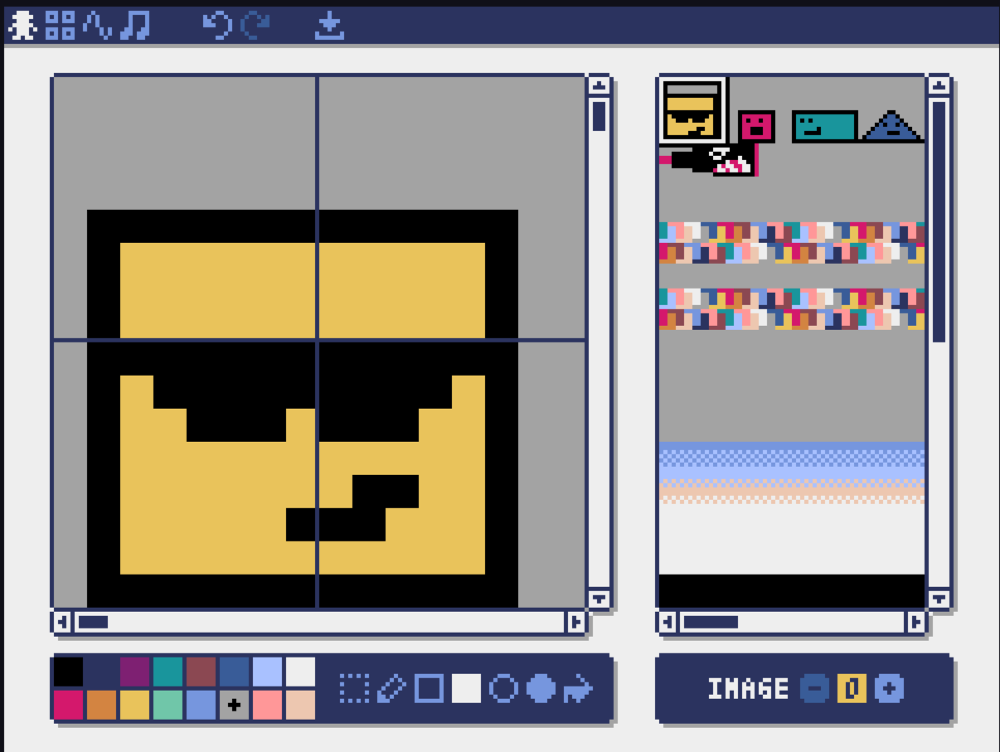
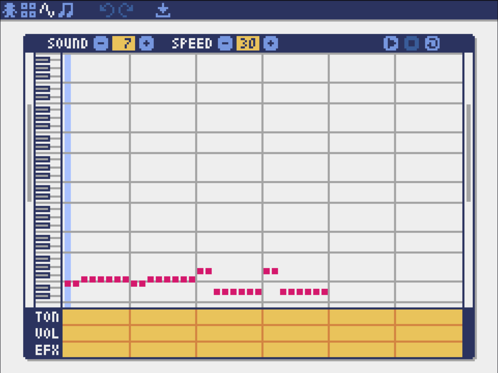

# MyPygames
### 1. Snow Screensaver 
### 2. Snake Game by arrows 
### 3. Pyxel 
Game created with [PyXel](https://github.com/kitao/pyxel) Python framework.

#### Pyxel Editor: 
In  editor you have to create skins and songs 
`square_run_assets.pyxres` file:

#### Start screen: 

#### Gameplay: 

#### First Final Screen : 

Second Final Screen : 
#### 
