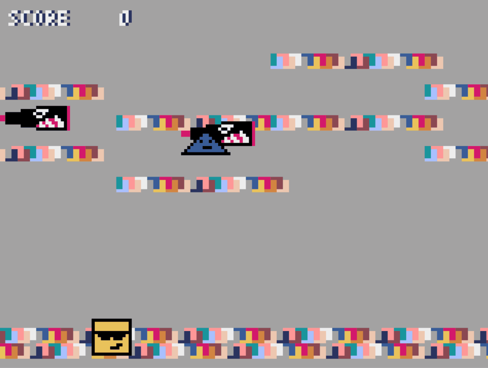
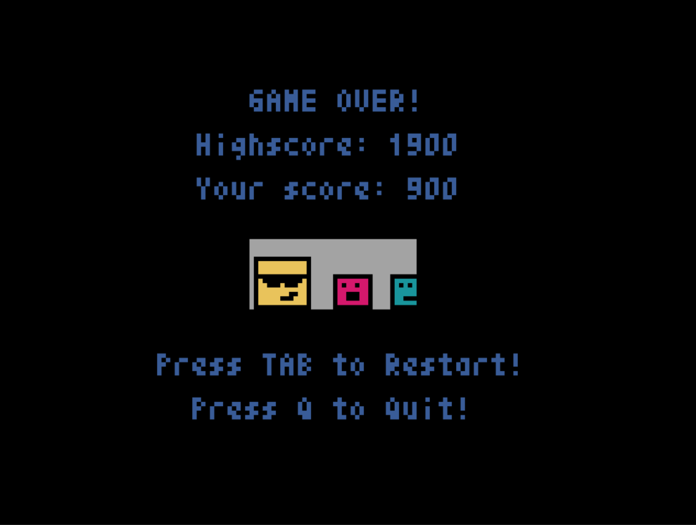
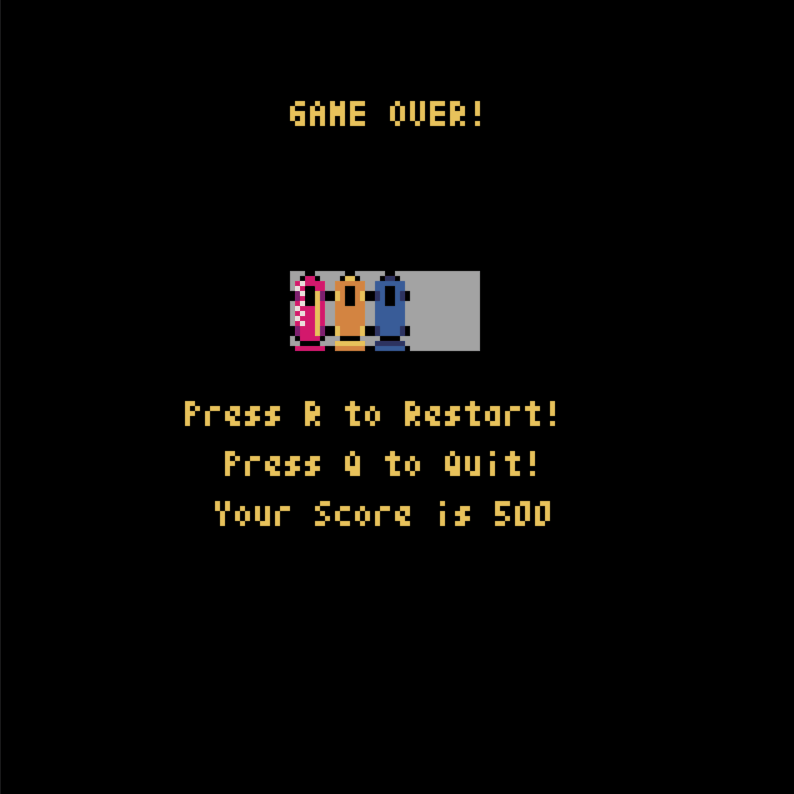
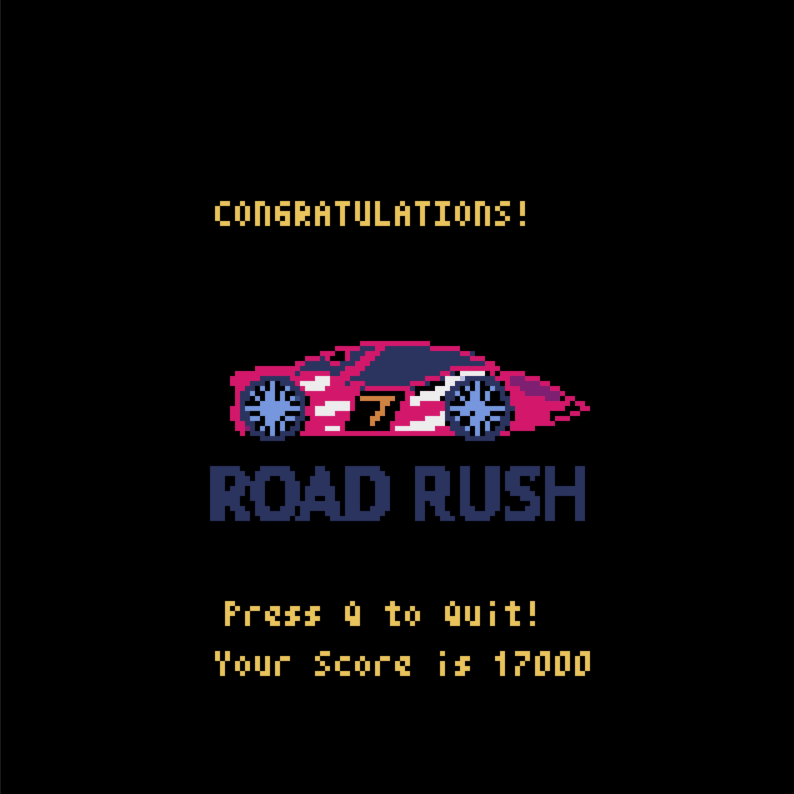
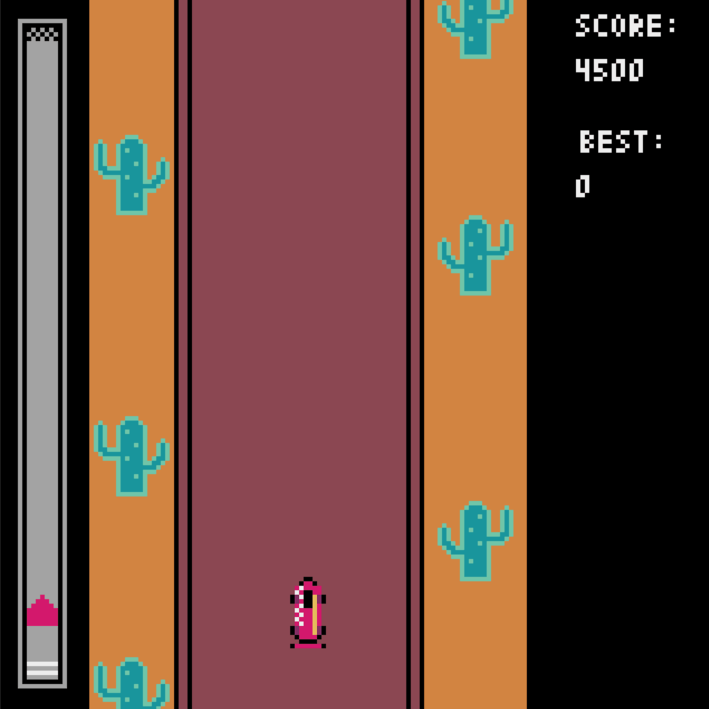

# Python Games  
## [PyGame](https://github.com/pygame/pygame/)  
#### 1. Image Movers  
#### 2. Snow Screensaver  
  

## [Tkinter](https://docs.python.org/3/library/tkinter.html)  
#### 1. Snake  

## [PyXel](https://github.com/kitao/pyxel)  
#### 1. Square Run 
Square pixel-style game, with enemies, friends, moving and stable backgrounds. Controls: `arrows` and `wasd`

 
 

#### 2. Road Rush 
Race pixel-style game. Controls: `arrows` and `ad`

  
  
