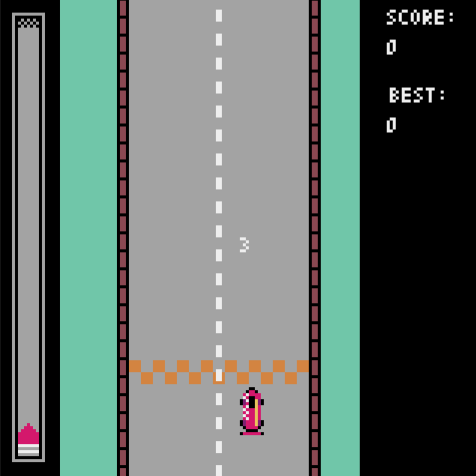

# Python Games  
## [PyGame](https://github.com/pygame/pygame/)  
### 1. Image Movers  
Experiments with PyGame:  

 

### 2. Snow Screensaver  
Screensaver Snowfall:

## [Tkinter](https://docs.python.org/3/library/tkinter.html)  
### 1. Snake  
Snake Game:  

## [PyXel](https://github.com/kitao/pyxel)  
### Pyxel Editor:  
In  editor you have to create skins and songs  
`square_run_assets.pyxres` file:

### 1. Square Run 
Square pixel-style game, with enemies, friends, moving and stable backgrounds. 
Controls: `arrows` and `wasd`

##### Start screen: 

##### Gameplay: 

##### First Final Screen : 

##### Second Final Screen : 

### 2. Road Rush 
Race pixel-style game:
##### Start screen: 

##### Ver 0.1

##### Ver 0.2

##### Ver 0.3

##### Ver 0.4

