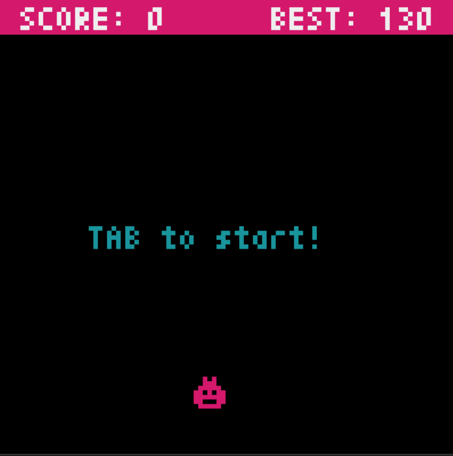

# Python Games  
## [PyGame](https://github.com/pygame/pygame/)  
#### 1. Image Movers  
#### 2. Snow Screensaver  
  
### 3. Alien Invasion  
Simple Game project from  [Python Crash Course 2nd Edition](https://www.amazon.com/Python-Crash-Course-Eric-Matthes-ebook/dp/B07J4521M3#:~:text=Python%20Crash%20Course%20is%20the,that%20work%20in%20no%20time.) book  
Controls: `arrows`, `AD` to shoot from different guns, `Q` to quit

## [Tkinter](https://docs.python.org/3/library/tkinter.html)  
#### 1. Snake  

## [PyXel](https://github.com/kitao/pyxel)  
#### 1. Square Run 
Square pixel-style game, with enemies, friends, moving and stable backgrounds. Controls: `arrows` and `wasd`, `R` for restart `Q` to quit

 
 

#### 2. Road Rush 
Race pixel-style game. Controls: `arrows` and `ad`, `R` for restart `Q` to quit

  
  

#### 3. Pyxel Rain 
You need to avoid brown triangles and catch green circles. Controls: `arrows` and `ad`, `R` for restart `Q` to quit

